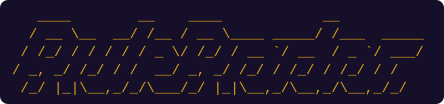
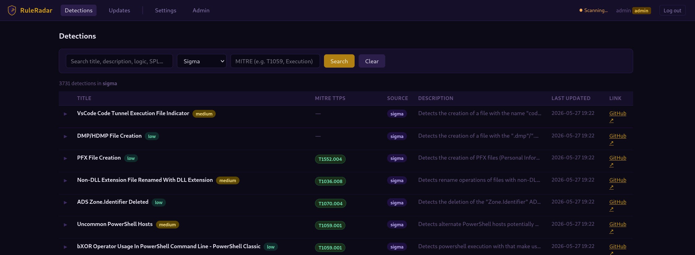

<p align="center">
  
</p>
<p align="center">
  
</p>

Monitors detection rule repositories — [SigmaHQ/sigma](https://github.com/SigmaHQ/sigma), [splunk/security_content](https://github.com/splunk/security_content), and [elastic/detection-rules](https://github.com/elastic/detection-rules) — for new, modified, deleted, and renamed rules. All data is stored in a local SQLite database and browsable through a built-in web interface. No config files required — everything is configured through the web UI.

<p align="center">
  
</p>

## What it does

Every two hours RuleRadar:
1. Fetches changes from all configured repos via `git fetch` and diffs against the last known commit
2. Parses new and modified rule files — `.yml`/`.yaml` (Sigma, Splunk) and `.toml` (Elastic)
3. Persists every detection and change event to SQLite
5. Sends a summary to every user who has a personal Discord webhook configured

The web interface provides:
- **Detections** — filter by title, description, severity, source, MITRE TTP, and time window; keyword search across detection logic, SPL, author, and references; saved filter presets
- **Updates** — chronological feed of new, modified, deleted, and renamed rules, filterable by source, change type, and time window
- **Settings** — per-user Discord webhook, saved filter presets, password change
- **Admin** — add/remove users, reset passwords, grant/revoke admin access, manage monitored repositories

---

## First run

### Install dependencies

```bash
python3 -m venv .venv
source .venv/bin/activate        # Windows: .venv\Scripts\activate
pip install -r requirements.txt
```

### Start everything

```bash
python3 start.py
```

Opens the **web interface** at **http://localhost:5000** and starts the **bi-hourly scheduler**.

On the very first visit you are prompted to create an admin account. After logging in:
- Go to **Admin** → enable the repositories you want to monitor (initial clone takes 2–5 minutes)
- Go to **Settings** → add a Discord webhook for personal notifications

### Run components individually

| Command | What it does |
|---------|-------------|
| `python3 core/ruleradar.py` | Run one scan cycle immediately |
| `python3 webapp/app.py` | Web interface only (port 5000) |
| `python3 core/scheduler.py` | Bi-hourly scheduler only |

---

## Running with Docker

```bash
docker compose up --build -d
```

Open **http://localhost:5000** and create your admin account.  
All settings (user accounts, Discord webhooks, repository data) are stored in a named Docker volume (`ruleradar-db`) and persist across restarts.

```bash
docker compose down          # stop
docker compose down -v       # stop + wipe all data
```

---

## Configuration (all via the web UI — no files needed)

| Setting | Where | Description |
|---------|-------|-------------|
| Monitored repos | Admin → Monitored Repositories | Enable any combination of SigmaHQ/sigma, splunk/security_content, and elastic/detection-rules, or add your own custom repository. Repos are cloned locally via git — no API token required. |
| Discord webhook | Settings → Discord Notifications | Per-user webhook for scan summaries. Create one in Discord: Server Settings → Integrations → Webhooks. |
| Saved filters | Settings → Saved Filters | Named presets (source, change type, title, MITRE TTP, severity, time window) that appear as quick-access buttons on the Detections and Updates pages. |
| Users | Admin → Users | Add users, reset passwords, grant/revoke admin, delete users. |

---

## Services

| Service | Description |
|---------|-------------|
| `web` | Flask web interface — login, browse, search, manage settings |
| `scheduler` | Runs a scan every two hours (00:00, 02:00 … 22:00 UTC) via APScheduler |

---

## First scan behaviour

On first setup an admin selects repositories to monitor. RuleRadar performs a shallow `git clone --depth=1` of each repo and indexes all matching rule files (`.yml`/`.yaml` for Sigma and Splunk, `.toml` for Elastic). Subsequent scans use `git fetch` and only process files that changed since the last indexed commit.
