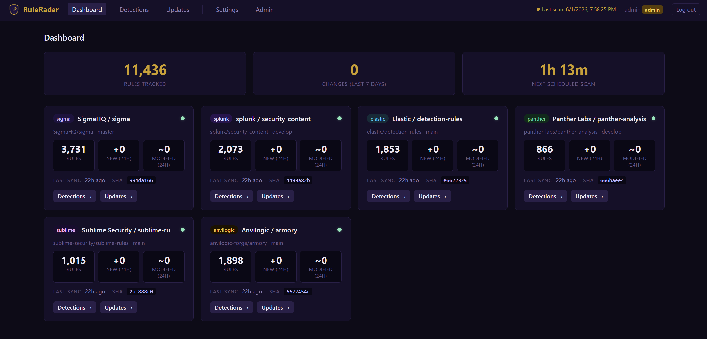

<p align="center">
  
</p>
<p align="center">
  
</p>

Monitors detection rule repositories for new, modified, deleted, and renamed rules. Supports [SigmaHQ/sigma](https://github.com/SigmaHQ/sigma), [splunk/security_content](https://github.com/splunk/security_content), [elastic/detection-rules](https://github.com/elastic/detection-rules), [panther-labs/panther-analysis](https://github.com/panther-labs/panther-analysis), [sublime-security/sublime-rules](https://github.com/sublime-security/sublime-rules), and [anvilogic-forge/armory](https://github.com/anvilogic-forge/armory) out of the box — with support for adding custom repositories. All data is stored in a local SQLite database and browsable through a built-in web interface. No config files required — everything is configured through the web UI.

<p align="center">
  
</p>

## What it does

Every two hours RuleRadar:
1. Fetches changes from all configured repos via `git fetch` and diffs against the last known commit
2. Parses new and modified rule files (`.yml`/`.yaml` for most repos; `.toml` for Elastic)
3. Extracts titles, descriptions, MITRE ATT&CK mappings, and detection logic per source format
4. Persists every detection and change event to SQLite
5. Sends a summary to every user who has a personal Discord webhook configured

The web interface provides:
- **Detections** — filter by title, description, source, MITRE TTP, and time window; keyword search across detection logic, author, and references; saved filter presets
- **Updates** — chronological feed of new, modified, deleted, and renamed rules, filterable by source, change type, and time window
- **Settings** — per-user Discord webhook, saved filter presets, password change
- **Admin** — add/remove users, reset passwords, grant/revoke admin access, manage monitored repositories

---

## Deployment

Choose one of the three methods below. All methods expose the web interface at **http://localhost:5000**.

On first visit you are prompted to create an admin account. After logging in, go to **Admin → Monitored Repositories** to enable the repos you want to monitor. The initial clone takes 2–5 minutes per repo.

---

### Method 1 — Local Install

**Requirements:** Python 3.10+, `git`

#### Install

```bash
git clone https://github.com/McSloats/RuleRadar.git
cd RuleRadar
python3 -m venv .venv
source .venv/bin/activate        # Windows: .venv\Scripts\activate
pip install -r requirements.txt
python3 start.py
```

`start.py` launches the Flask web server (port 5000) and the bi-hourly scheduler together in one process. Pass `--run-now` to also fire an immediate scan on startup.

Run components individually if needed:

| Command | What it does |
|---------|-------------|
| `python3 webapp/app.py` | Web interface only (port 5000) |
| `python3 core/scheduler.py` | Bi-hourly scheduler only |
| `python3 core/ruleradar.py` | Run one scan cycle immediately |

#### Update

```bash
source .venv/bin/activate        # Windows: .venv\Scripts\activate
git pull
pip install -r requirements.txt
python3 start.py
```

#### Uninstall / Cleanup

```bash
# Stop the running process (Ctrl+C or kill the PID), then:
deactivate
cd ..
rm -rf RuleRadar                 # Windows: Remove-Item -Recurse -Force RuleRadar
```

This removes the code, virtual environment, and the SQLite database (`ruleradar.db`) along with all cloned repos stored under `data/`.

---

### Method 2 — Docker Compose

**Requirements:** Docker with the Compose plugin (v2). The pre-built image is pulled automatically from Docker Hub ([`tsloats/ruleradar`](https://hub.docker.com/r/tsloats/ruleradar)) — no local build required.

#### Install

```bash
# Download the Compose file
curl -O https://raw.githubusercontent.com/McSloats/RuleRadar/main/docker-compose.yml

# Start both services (web + scheduler) in the background
docker compose up -d
```

All data — the SQLite database, cloned repos, and secret key — is stored in the named volume `ruleradar-db` and persists across restarts.

Useful commands while running:

```bash
docker compose logs -f           # stream live logs from both services
docker compose ps                # check container status and health
```

#### Update

```bash
docker compose pull              # fetch the latest image from Docker Hub
docker compose up -d             # recreate containers with the updated image
```

Your data volume is preserved; no data is lost during an update.

#### Stop / Cleanup

```bash
# Stop containers (data is preserved)
docker compose down

# Stop containers AND delete all data
docker compose down -v
```

`down -v` removes the `ruleradar-db` volume — this permanently deletes the database, all cloned repos, and the secret key.

---

### Method 3 — Docker Pull (manual, no Compose)

**Requirements:** Docker Engine. Use this if you prefer to manage containers directly without a Compose file.

#### Install

```bash
# Pull the image
docker pull tsloats/ruleradar:latest

# Create a named volume for persistent data
docker volume create ruleradar-db

# Start the web container
docker run -d \
  --name ruleradar-web \
  -p 5000:5000 \
  -v ruleradar-db:/app/data \
  -e RULERADAR_DB=/app/data/ruleradar.db \
  -e PYTHONUNBUFFERED=1 \
  --restart unless-stopped \
  tsloats/ruleradar:latest

# Start the scheduler container (waits for web to be up)
docker run -d \
  --name ruleradar-scheduler \
  -v ruleradar-db:/app/data \
  -e RULERADAR_DB=/app/data/ruleradar.db \
  -e PYTHONUNBUFFERED=1 \
  --restart unless-stopped \
  tsloats/ruleradar:latest \
  python3 core/scheduler.py
```

Useful commands while running:

```bash
docker logs -f ruleradar-web        # stream web logs
docker logs -f ruleradar-scheduler  # stream scheduler logs
docker ps                           # check running containers
```

#### Update

```bash
# Pull the new image
docker pull tsloats/ruleradar:latest

# Recreate the containers (data volume is preserved)
docker stop ruleradar-web ruleradar-scheduler
docker rm ruleradar-web ruleradar-scheduler

docker run -d \
  --name ruleradar-web \
  -p 5000:5000 \
  -v ruleradar-db:/app/data \
  -e RULERADAR_DB=/app/data/ruleradar.db \
  -e PYTHONUNBUFFERED=1 \
  --restart unless-stopped \
  tsloats/ruleradar:latest

docker run -d \
  --name ruleradar-scheduler \
  -v ruleradar-db:/app/data \
  -e RULERADAR_DB=/app/data/ruleradar.db \
  -e PYTHONUNBUFFERED=1 \
  --restart unless-stopped \
  tsloats/ruleradar:latest \
  python3 core/scheduler.py
```

#### Stop / Cleanup

```bash
# Stop and remove containers (data volume is preserved)
docker stop ruleradar-web ruleradar-scheduler
docker rm ruleradar-web ruleradar-scheduler

# Also remove the data volume (permanently deletes all data)
docker volume rm ruleradar-db

# Optionally remove the image
docker rmi tsloats/ruleradar:latest
```

---

## Configuration (all via the web UI — no files needed)

| Setting | Where | Description |
|---------|-------|-------------|
| Monitored repos | Admin → Monitored Repositories | Enable any of the six built-in repos (Sigma, Splunk, Elastic, Panther, Sublime, Anvilogic) or add your own custom repository. Repos are cloned locally via git — no API token required. |
| Discord webhook | Settings → Discord Notifications | Per-user webhook for scan summaries. Create one in Discord: Server Settings → Integrations → Webhooks. |
| Saved filters | Settings → Saved Filters | Named presets (source, change type, title, MITRE TTP, time window) that appear as quick-access buttons on the Detections and Updates pages. |
| Users | Admin → Users | Add users, reset passwords, grant/revoke admin, delete users. |

---

## Architecture

| Component | Description |
|-----------|-------------|
| `web` | Flask web interface — login, browse, search, manage settings |
| `scheduler` | Fires a scan every two hours (00:00, 02:00 … 22:00 UTC) via APScheduler |

Both components share a single SQLite database (WAL mode). In Docker they share the `ruleradar-db` volume. On first setup an admin enables repositories; RuleRadar performs a shallow `git clone --depth=1` of each repo and indexes all matching rule files. Subsequent scans use `git fetch` and only process files changed since the last indexed commit.
